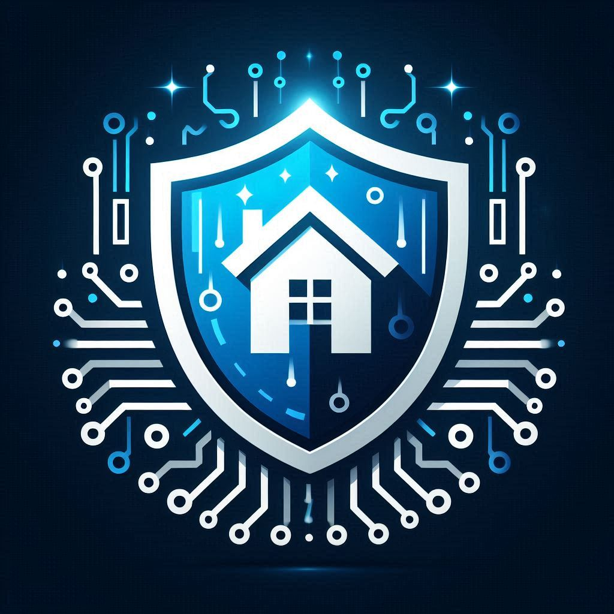
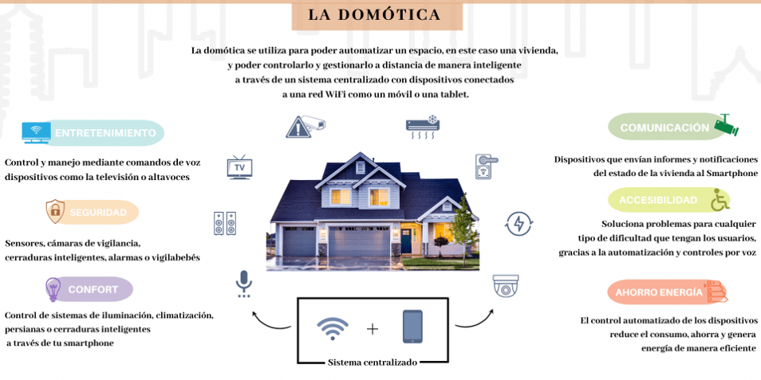
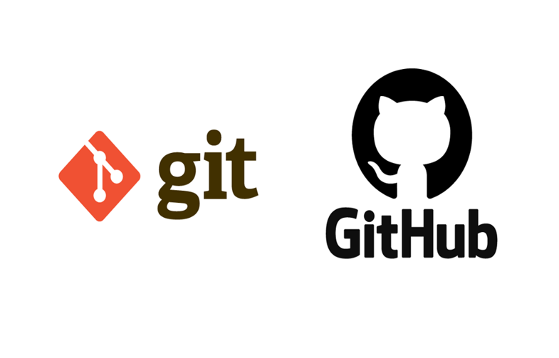

# Virtual XP


Despliegue de página web en HTMLs para agencia de desarrollo de aplicaciones móviles, smart TV, wearables y proyectos IoT. 
```
Integrantes: 
    Rubén Guerra Navea.
    Carolina Navarrete.
Supervisor: 
    Cristopher Espinoza.
```
Índice: 

***Presentación de proyecto Virtual Xp:***

[¿Quiénes somos?](#Quiénes-somos)   

[¿Qué ofrecemos?](#qué-ofrecemos)   

[Herramientas que utilizaremos](#herramientas-que-utilizaremos) 

[Dispositivos wearables](###dispositivos-wearables) 

[Domótica](#domótica)  

[Detalles de la implementación de página web para virtualidad Xp](#detalles-de-la-implementación-de-página-web-para-virtualidad-xp) 

[Resumen](#resumen) 

[Análisis de requisitos](#análisis-de-requisitos)

[Características de la implementación de Virtual Xp](#características-de-la-implementación-de-virtual-xp)   

[Resumen](#resumen)

[Análisis de requisitos](#análisis-de-requisitos)   

[Características de la implementación de Virtual Xp](#características-de-la-implementación-de-virtual-xp)   

[Framework](#framework)

[Lenguaje de programación](#lenguaje-de-programación)   

[XAMPP como servidor gratuito](#xampp-como-servidor-gratuito)   

[Base de datos](#base-de-datos) 

[El editor de código](#el-editor-de-código) 

[Para mejorar la experiencia del usuario](#para-mejorar-la-experiencia-del-usuario) 

[Creación y estética](#creación-y-estética) 

[Tokens de autenticación](#tokens-de-autenticación) 

[Botones de autenticado](#botones-de-autenticado)   

[Pruebas de vulnerabilidades aplicadas al sistema de la página](#pruebas-de-vulnerabilidades-aplicadas-al-sistema-de-la-página) 

[Verificación de puertos](#verificación-de-puertos)


```Virtualidad Xp. La seguridad y la domótica mas cerca```

## ***¿Quiénes somos?***

Somos un equipo que atiende a necesidades tecnológicas dedicada a domótica, seguridad y artículos wearables. 
Nuestra visión es la búsqueda de soluciones para facilitar la vida de los clientes, tanto como otorgar herramientas para  sincronizar las actividades y la seguridad de quienes confían en nuestros servicios. 
Apuntamos a una modernización acorde a las herramientas y tecnologías que hoy son necesarias. 

## ***¿Qué ofrecemos?***
> #### Planes de seguridad.
>
> - *Básico.* Instalaciòn de cámaras de seguridad IP/ o con almacenamiento en nube.
> - *Black*. Instalación de cámaras de seguridad IP y sistema antiportonazos.  
>  *Premium.* Instalación de cámaras de seguridad más sistema antiportonazos y suite de domótica.

 
## ***Herramientas que utilizaremos:***

Herramientas para desarrollo de aplicaciones en reemplazo de Android Studio. 
Herramientas para el desarrollo de paginas web. 
Herramientas para las configuraciones de seguridad. 

Descripción de tecnologìas que ofrecemos




### ***Dispositivos wearables***
Puede que la palabra wearable resulte un poco ajena a nuestro vocabulario diario, pero la realidad es que convivimos con ella cada vez más. Es un término que viene del idioma inglés y que significa, ni más ni menos, “vestible” o “ponible”. Por eso, cuando hablamos de dispositivos wearables nos referimos a los relojes, pulseras, auriculares, gafas, zapatillas, llaveros o cualquier otro accesorio o prenda de vestir que llevemos encima y que sea capaz de realizar alguna tarea adicional al tiempo que nos ofrece datos de nuestro interés, como estado de salud, rutinas, lugares, noticias, previsión meteorológica, entre otros.

### ***Domótica***
El significado de domótica hace referencia al conjunto de sistemas y tecnologías capaces de automatizar una vivienda, mediante la gestión inteligente de la energía, las comunicaciones, la iluminación, la seguridad y todos los elementos de una vivienda o edificación con el fin de aportar seguridad, bienestar y confort.  Entonces, ¿Qué es la domótica? básicamente es una tecnología que nos permite gestionar una vivienda de forma inteligente y automática. Estos sistemas pueden estar integrados por medio de redes interiores y exteriores de comunicación, cableadas o inalámbricas, y cuyo control goza de cierta ubicuidad, desde dentro y fuera del hogar.

## ***Detalles de la implementación de página web para virtualidad Xp***



## ***Resumen***
Nuestro trabajo de investigación, tiene como objetivo principal abordar la implementación de una página HTML para la creación de una agencia de desarrollo virtual llamada Virtual Xp, la cual aborda los siguientes aspectos: aplicaciones móviles, Smart TV, wereables y proyectos IoT. Nuestro trabajo será realizado por medio del sistema de control de versiones de Git hub y el apoyo de Visual Studio Code. En nuestra investigación, explicaremos en profundidad estos 4 aspectos fundamentales para el desarrollo de nuestra página web, así como también los paso a paso para la creación de la página web, hasta el desarrollo final de esta que incluirá el link de la página web y el repositorio de Git Hub. 


## ***Análisis de requisitos***
En el analisis de requisitos, veremos los programas y requisitos técnicos. 

Es importante señalar que para la realización de este proyecto, se ha requerido el uso de Github. Éste puede ser instalado en Windows, Mac y Linux. 
Algunos comandos y links para llevarlo a cabo son:   

* $apt-get install git
* $ yum install git
* $ yum install curl-devel expat-devel gettext-devel / openssl-devil zlib-devel

## ***Características de la implementación de Virtual Xp***

### ***Framework:***
Para el desarrollo de Virtual Xp, utilizamos Bootstrap, como un conjunto de herramientas de interfaz con muchas funciones, con el objeto de poder desarrollar nuestra página web.

### ***Lenguaje de programación:***
Se utilizó el lenguaje de programación PHP, el cual es fácilmente adaptable al desarrollo de las páginas web. Con este lenguaje de programación, accedemos a php my admin como aplicación web, para lo que refiere al manejo de las bases de datos, y el acceso al servidor es el servidor:127.0.0.1 vía TCP/IP.

### ***XAMPP como servidor gratuito:***
Utilizamos XAMPP, para la creación y distribución del desarrollo de nuestra web en Apache, un servidor de código abierto, el cual nos permite trabajar de manera libre y sin costos; XAMPP, para efectos como hosting gratuito para poder revisar lo referente al frontend de la página.

### ***Base de datos:***
La base de datos es Mysql, como gestión de base de datos organizacional, fue utilizado para la creación de Virtual, debido al manejo del código de base abierto, con lo cual, nos fue posible insertar nuestra base de datos para nuestro proyecto, y así conectar nuestra página con el servidor.


###  ***El editor de código*** 
Se utilizó Visual Studio Code para implementar el proyecto Virtual Xp, con el cual era posible poder revisar nuestros códigos html, realizar cambios y correcciones, trabajar con código JS y CSS, para lo que refiere a la estética de la página.

### ***Para mejorar la experiencia del usuario***
Se utilizó JS en la creación de Virtual Xp para crear nuestra página interactiva.

### ***Creación y estética***
Para hacer más fácil la habilitación de efectos de color, tamaño de letras y efectos varios de la página se recurrió a herramientas de CSS.

### ***Tokens de autenticación***
El Token Json otorga un estándar de industria para la creación de Token seguro. Sirvió en el objetivo de autenticar y autorizar a los usuarios en las aplicaciones web y móviles.
Password Hash Bcrypt
Utilizado como algoritmo, de hashing de la contraseña de Virtual Xp, con el objeto de darle seguridad a la base de datos.

### ***Botones de autenticado***
Los botones de autenticado e ingreso de contraseñas, otorgó un toque estético a Virtual Xp.

## ***Pruebas de vulnerabilidades aplicadas al sistema de la página***

Se realizaron pruebas para detección de vulnerailidades mediante la tecnología otorgada por NMAP. 
Inicialmente se  encontraron deficiencias de seguridad contra ataques DoS, y la vulnerabilidad Diffie Hellman Key, la cual la hacía vulnerable a ataques pequeños y ataques Man in the Middle.
Ambas deficiencias han sido corregidas.

### ***Verificación de puertos***
Se recurrió a pruebas mediante Owas ZAP, con la cual se comprobó la existencia inicial de diversos puntos vlnerables a ataques en la página, los cuales fueron referenciados con puntos rojos.


                La domótica más cerca.


